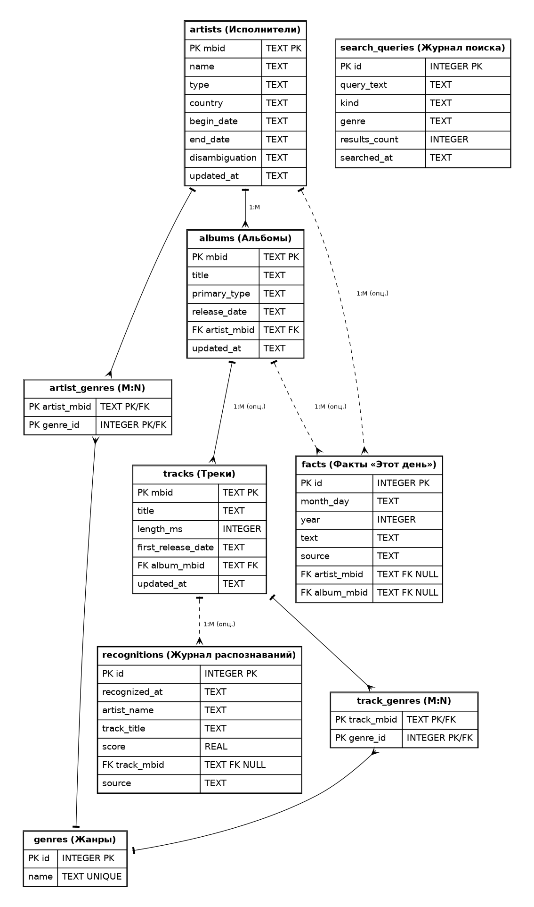

# Music Wiki

Музыкальная вики в стиле Windows XP на Flask: поиск песен и исполнителей
(MusicBrainz), биографии и похожие артисты (Last.fm), распознавание песни
по записи (AudD).

```bash
pip install -r requirements.txt
cp .env.example .env        #заполнить LASTFM_API_KEY, AUDD_API_TOKEN, MB_CONTACT
python download_assets.py   # один раз: xp.css + иконки Silk в static/
flask --app app run --debug
```

- Факты «Этот день»: `data/on_this_day.json` (ключ ММ-ДД), пополняется вручную, перезапуск не нужен.
  Альбомы с открытых страниц артистов добавляются в базу фактов автоматически.
- Бегущая строка: `data/music_facts.json`.
- Цитаты в подсказке маскота: `services/quotes.py` (список `MUSIC_QUOTES`).
- Запись с микрофона работает только на https:// или http://localhost.


## База данных

Проект использует две SQLite-базы в `instance/` (создаются автоматически при старте):

- `cache.sqlite3` — технический key-value кэш ответов MusicBrainz / Last.fm / AudD (`services/cache.py`);
- `wiki.sqlite3` — реляционная предметная база: `artists`, `albums`, `tracks`, `genres`,
  `artist_genres`, `track_genres`, `facts`, `recognitions`, `search_queries`
  (схема — `db/schema.sql`, доступ к данным — `services/store.py`).

Данные попадают в `wiki.sqlite3` автоматически: при открытии страницы артиста или трека,
при поиске и при распознавании аудио. Демонстрационные данные: `python scripts/seed_demo.py`.


## Docker и CI/CD

```bash
docker build -t music-wiki .
docker run -p 5000:5000 --env-file .env music-wiki
```

Готовый образ публикуется GitHub Actions в GitHub Container Registry при каждом push в `main`:

```bash
docker pull ghcr.io/qwdxx012/music-wiki:latest
```

Workflow: `.github/workflows/build.yml` (задачи `test` → `build`).
